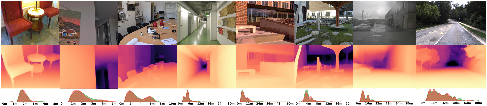
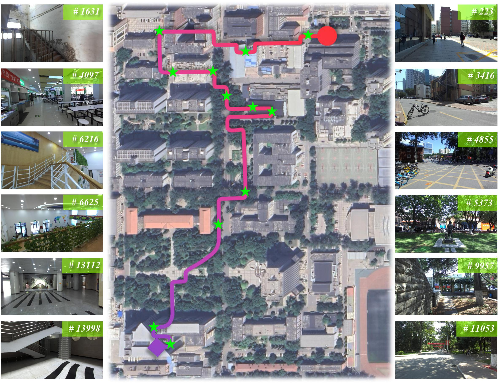

<p align="center">
  <h1 align="center">
  
  <!-- Indoor Obstacle Discovery on Reflective Ground via Monocular Camera -->
  SM<sup>4</sup>Depth</h1>
    <h2 align="center"><u>S</u>eamless <u>M</u>onocular <u>M</u>etric Depth Estimation</br>across <u>M</u>ultiple Scenes and Cameras by One <u>M</u>odel</h2>
    
  <p align="center">
    <a href="https://github.com/1hao-Liu"><strong>Yihao Liu<sup>*</sup></strong></a>
    ·
    <a href="https://xuefeng-cvr.github.io"><strong>Feng Xue<sup>*</sup></strong></a>
    ·
    <a href="https://teacher.bupt.edu.cn/mal"><strong>Anlong Ming</strong></a>
  </p>
  <p align="center">(* denotes equal contribution)</p>
  <h3 align="center"><a href="https://arxiv.org/abs/2403.08556">arXiv</a> | <a href="https://xuefeng-cvr.github.io/SM4Depth">Project Page</a></h3>
  <div align="center"></div>
</p>
<p align="center">
  <a href="">
    
  </a>
</p>
<br>


## News

- [x] 2024.3.14 The paper has been released on arXiv.

# ⭐️⭐️ Code and datasets will be released soon !⭐️⭐️


# Introduction

In this paper, we propose an approach that is capable of
learning widely-varying depth ranges of various scenes from different cameras, which can be seamlessly applied to both indoor and outdoor scenes, called SM4Depth. By training on 15w RGB-Depth pairs with various scales, SM4Depth outperforms the state-of-the-art methods on all never-seen-before datasets.

<!--  -->

<video id="video" autoplay controls muted loop playsinline>
      <source id="mp4" src="./files/buptvideo6.mov" type="video/mp4">
</video>


To evaluate the accuracy consistency of MMDE across
indoor and outdoor scenes, we propose the **BUPT Depth**
dataset. It consists of 14,932 continuous RGB-Depth pairs
captured from the campus of Beijing University of Posts and
Telecommunications (BUPT) by the ZED2. It also contains the re-generated depth maps
from [CreStereo](https://github.com/megvii-research/CREStereo) and the sky masks from [ViT-Adapter](https://github.com/czczup/ViT-Adapter).
The color and depth streams are captured with the focal
length of **1091.517** and the baseline of **120.034mm**.

# Environments setup

Following SM4Depth, you need **an NVIDIA 3090** (or a GPU with memory > 24G) and **400G** of space for the training sets.

```bash
# create conda environment
conda create -n sm4depth python=3.8
pip install torch==1.9.0+cu111 torchvision==0.10.0+cu111 torchaudio==0.9.0 -f https://download.pytorch.org/whl/torch_stable.html  # torch 1.10 is also OK !

# install requirements
pip install opencv-python tensorboardX timm thop scipy h5py
pip install "git+https://github.com/facebookresearch/pytorch3d.git@stable"

# dowload sm4depth code
cd && git clone https://github.com/1hao-Liu/SM4Depth.git
```

# Dataset Preparation for Zero-shot Evaluation

All data can be downloaded using [RESOURCE](RESOURCE.md).

The resource folder should have the following structure:

*\* denotes unzip the file here.*
<br>

     └── MODELS_ROOT
         ├── best_ckpt
         └── simmim_finetune__swin_base__img224_window7__800ep.pth
     └── TESTING_SETS_ROOT
         ├── * DDAD.zip
         ├── * ETH3D.zip
         ├── * iBims1.zip
         ├── * kitti_dataset.zip
         ├── * nuScenes
         ├── * nyu_test.zip
         ├── * SUNRGBD.zip
         └── BUPTDepth
             ├── * left.zip
             ├── ...
             └── * crestereo.zip

extract BUPTDepth's depthmap information in meters: 
```python
# depth values exceeding 30m are invalid
# zed2 depth
depth = Image.open(depth_file)
depthmap = np.asarray(depth, dtype=np.float32) / 256.0
# crestereo depth
depth = Image.open(depth_file)
depthmap = np.asarray(depth, dtype=np.float32) * 1.2231 / 256.0
```

# Inference (quick start)

Please check the content of [configs/test.txt](configs/test.txt) and fill in the image's info in [data_splits/quick_test.txt](data_splits/quick_test.txt) before you use it for the first time

```bash
conda activate sm4depth
cd && cd SM4Depth/sm4depth
python test.py ../config/test.txt
```

# Evaluation

Please check the content of [configs/eval.txt](configs/eval.txt) before you use it for the first time

```bash
conda activate sm4depth
cd && cd SM4Depth/sm4depth
python eval.py ../config/eval.txt

# for example: test sm4depth on iBims-1 datset
== Load encoder backbone from: None
== Total number of parameters: 128403284
== Total number of learning parameters: 128403284
== Model Initialized
== Loading checkpoint '/data_root/models/best_ckpt'
== Loaded checkpoint '/data_root/models/best_ckpt'
100%|█████████████████████████████████████████████████████████████████████████████| 100/100 [00:10<00:00,  9.57it/s]
Computing errors for 100 eval samples , post_process:  True
  silog, abs_rel,   log10,     rms,  sq_rel, log_rms,      d1,      d2,      d3
10.4001,  0.1346,  0.0620,  0.6732,  0.1232,  0.1704,  0.7904,  0.9781,  0.9922
```

# License

This repository is released under the Apache 2.0 license as found in the [LICENSE](LICENSE) file.

# Citation

If you use SM4Depth, please consider citing:


**Acknowledgments:**

SM4Depth builds on previous works code base such as [NeWCRFs](https://github.com/aliyun/NeWCRFs) and [DANet](https://github.com/YiLiM1/DANet). If you found SM4Depth useful please consider citing these works as well.
