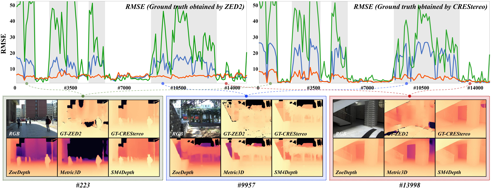

# <u>SM4</u>Depth: <u>S</u>eamless <u>M</u>onocular <u>M</u>etric Depth Estimation across <u>M</u>ultiple Cameras and Scenes by One <u>M</u>odel

#### [Yihao Liu](https://github.com/1hao-Liu)\*, [Feng Xue](https://xuefeng-cvr.github.io//)\*, [Anlong Ming](https://teacher.bupt.edu.cn/mal) ####

(\* denotes equal contribution)

### [`Paper`]() [`Project`]()

# Code and datasets are coming soon !

# Introduction

In this paper, we propose SM4Depth, an approach that is capable of
learning widely-varying depth ranges of various scenes from different cameras, which can be seamlessly applied to both indoor and outdoor scenes. By training on 15w RGB-Depth pairs with various scales, SM4Depth outperforms the state-of-the-art methods on all never-seen-before datasets.

To evaluate the accuracy consistency of MMDE across
indoor and outdoor scenes, we propose the **BUPT Depth**
dataset. It consists of 14,932 continuous RGB-Depth pairs
captured from the campus of Beijing University of Posts and
Telecommunications (BUPT) by the ZED2. It also contains the re-generated depth maps
from [CreStereo](https://github.com/megvii-research/CREStereo) and the sky masks from [ViT-Adapter](https://github.com/czczup/ViT-Adapter).
The color and depth streams are captured with the focal
length of **1091.517** and the baseline of **120.034mm**.

# License

This repository is released under the Apache 2.0 license as found in the [LICENSE](LICENSE) file.

# Citation

If you use SM4Depth, please consider citing:

**Acknowledgments:**

SM4Depth builds on previous works code base such as [NeWCRFs](https://github.com/aliyun/NeWCRFs) and [DANet](https://github.com/YiLiM1/DANet). If you found SM4Depth useful please consider citing these works as well.